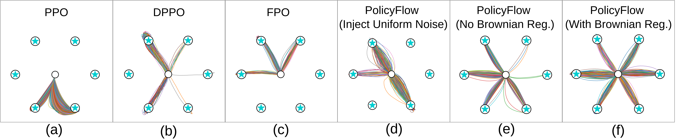

# PolicyFlow
[](https://docs.isaacsim.omniverse.nvidia.com/latest/index.html)
[](https://isaac-sim.github.io/IsaacLab)
[](https://docs.python.org/3/whatsnew/3.11.html)
[](https://releases.ubuntu.com/20.04/)
[](https://opensource.org/license/mit)


This repository provides the official implementation of ["PolicyFlow: Policy Optimization with Continuous Normalizing Flow in Reinforcement Learning"](https://openreview.net/forum?id=YETCQLcKtn&referrer=%5BAuthor%20Console%5D(%2Fgroup%3Fid%3DICLR.cc%2F2026%2FConference%2FAuthors%23your-submissions)).

---

MultiGoal Test: Sample 1000 trajectories starting at the same original point.


In the main branch, we provide training scripts for: **IsaacLab environments** (currently among the most widely used robotics simulation frameworks), **MultiGoal** and **Gym environments**, where the scripts serve as clear examples for users who wish to register and train their own custom environments.

These scripts are intended to be lightweight, easy to read, and helpful for users who want to quickly adapt our algorithms to their own tasks.

---

### 

### Installation
1. Install IsaacLab/IsaacSim

    For users who wish to run the IsaacLab environment examples, please follow the official NVIDIA installation [guides](https://isaac-sim.github.io/IsaacLab/main/source/setup/installation/pip_installation.html) to install both IsaacLab and IsaacSim. 

    We strongly recommend using the **Conda-based installation** method provided by NVIDIA, as it ensures correct package versions and avoids conflicts with Omniverse/IsaacSim dependencies.

    After completing the installation, NVIDIA’s setup will create a Conda environment (e.g., env_isaaclab). Activate it:
    ```bash
    conda activate env_isaaclab
    ```
    All subsequent installation steps for PolicyFlow should also be performed inside this same environment.
  
2. Install [Gymnasium-Robotics](https://robotics.farama.org/envs/maze/) (Optional)

   Just for the PointMaze example:
   ```bash
   pip install gymnasium-robotics[mujoco-py]
   ```
3. Install PolicyFlow

   After setting up the environment and optional dependencies, clone this repository and install PolicyFlow in editable mode.

    ```bash
    git clone https://github.com/MoreInfoy/PolicyFlow.git
    cd PolicyFlow/policyflow
    pip install -e .
    ```

---


### Training Your Own Policy
Once you have completed the installation and activated your environment (env_isaaclab), you can start training your own policies using the provided scripts. 

For example, to train a policy for the Isaac-Velocity-Flat-Anymal-D task using PolicyFlow, you can run the following command in your activated environment (env_isaaclab):
```bash
python scripts/isaaclab/train.py \
    --task=Isaac-Velocity-Flat-Anymal-D-PF \
    --headless \
    --log_dir=runs_pf/Anymal_d_policyflow \
    --actor_hidden_dims 128 128 128 \
    --actor_activations elu elu elu linear \
    --critic_hidden_dims 128 128 128 \
    --critic_activations elu elu elu linear \
    --obs_embeding_dims 64 \
    --max_iterations=7001 \
    --rollouts=24
```
**Parameter Explanations:**

- `--headless` : Run the simulation without rendering (faster training).  
- `--log_dir` : Directory to save logs and checkpoints.  
- `--actor_hidden_dims` / `--critic_hidden_dims` and `--actor_activations` / `--critic_activations` : Define network architectures for actor and critic.  
- `--obs_embeding_dims` : Dimension of the observation embedding.  
- `--max_iterations` : Total number of training iterations.  
- `--rollouts` : Number of parallel simulations per iteration.

For additional example commands and benchmarks using IsaacLab environments, please refer to [`run_benchmark.sh`](scripts/isaaclab/run_benchmark.sh). If you want to register your **own custom IsaacLab environments**, you can refer to [`register_envs.py`](scripts/isaaclab/register_envs.py).

---

**MultiGoal and Gym Envs**

To train a policy on the **MultiGoal** environment, you can run:

```bash
python scripts/multigoal/train.py
```
After training, the models are saved in `runs/multigoal`. You can visualize the trajectories using:

```bash
python scripts/multigoal/play.py
```
**Note**: Before running play.py, make sure to update Line 177 in `scripts/multigoal/play.py` with the path to your trained model.

To train a policy on `PointMaze_Medium_Diverse_GDense-v3`, you can run:

```bash
python scripts/gym/train.py
```

## Acknowledgements

Our implementation of the **ContinuousNormalizingFlow** is inspired by [**CleanDiffuser**](https://github.com/CleanDiffuserTeam/CleanDiffuser).  
The overall PolicyFlow code also draws inspiration from both [RSL-RL](https://github.com/leggedrobotics/rsl_rl) and [SKRL](https://github.com/Toni-SM/skrl).  

We sincerely thank the authors of these projects for their open-source contributions, which greatly facilitated our work.
